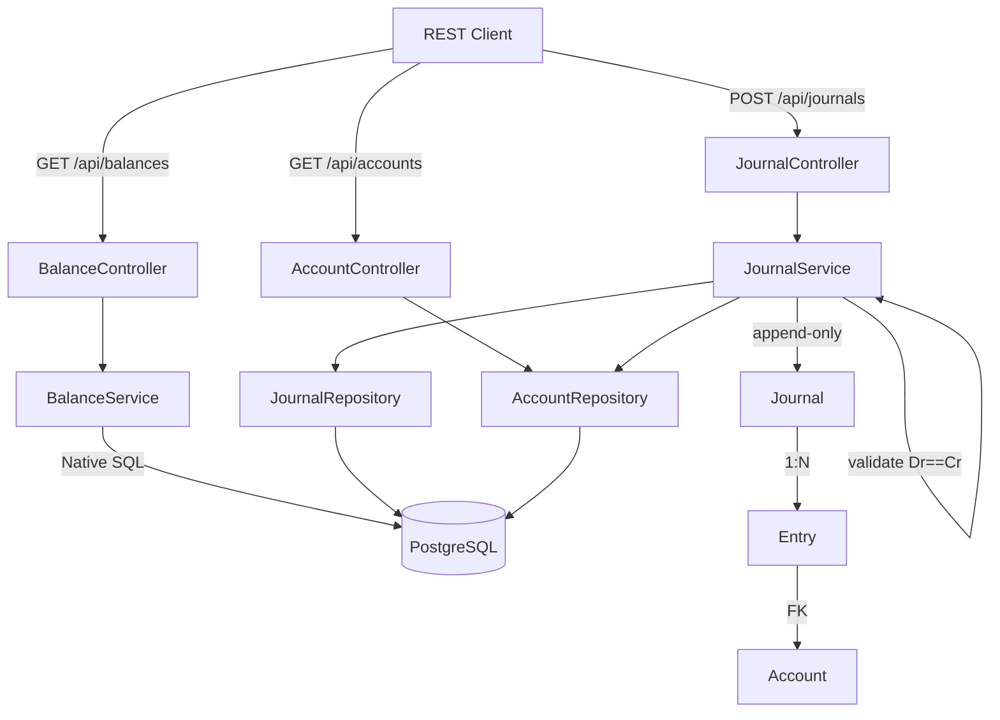

# 📒 복식부기 원장 시스템 (Double-Entry Ledger)

> **백엔드 개발자 포트폴리오** — 금융권·대기업·IT 취업 타겟

복식부기(Double-Entry Bookkeeping) 원칙을 구현한 계좌 원장 시스템입니다. 모든 거래는 차변(Dr)과 대변(Cr)이 항상 같아야 한다는 불변식을 강제하며, 분개(Journal)는 append-only로 관리됩니다.

---

## 🏗️ 아키텍처



## 🔧 기술 스택

| 계층 | 기술 |
|------|------|
| 언어 | Kotlin 2.0 |
| 프레임워크 | Spring Boot 3.3 |
| DB | PostgreSQL 16 |
| 빌드 | Gradle 9.5 (Kotlin DSL) |
| 테스트 | JUnit 5 + Testcontainers |
| 인프라 | Docker Compose |

## 📊 도메인 모델

```
Account (계정과목)
 ├─ ASSET (자산): 현금, 은행예금, 미수금
 ├─ LIABILITY (부채): 미지급금, 차입금
 ├─ EQUITY (자본): 자본금, 이익잉여금
 ├─ REVENUE (수익): 급여수익, 이자수익
 └─ EXPENSE (비용): 식비, 월세, 이자비용

Journal (분개) — 하나의 거래 = 복수의 분개항목
 ├─ id, date, description
 └─ [Entry*]

Entry (분개항목)
 ├─ account (FK), amount, side (DEBIT/CREDIT)
 └─ journal (FK)
```

## 🚀 실행 방법

```bash
# 1. PostgreSQL 실행
docker-compose up -d

# 2. 애플리케이션 실행
./gradlew bootRun

# 3. API 테스트
# 계정과목 목록
curl http://localhost:8080/api/accounts

# 분개 등록 (차변=대변 필수)
curl -X POST http://localhost:8080/api/journals \
  -H "Content-Type: application/json" \
  -d '{
    "description": "사무실 월세 지급",
    "journalDate": "2026-05-05",
    "entries": [
      {"accountCode": "501", "side": "DEBIT", "amount": 1000000},
      {"accountCode": "101", "side": "CREDIT", "amount": 1000000}
    ]
  }'

# 잔액 조회
curl http://localhost:8080/api/balances/101

# 합계잔액시산표
curl http://localhost:8080/api/balances/trial-balance
```

## 🧠 핵심 설계 결정

### 복식부기 불변식 (Double-Entry Invariant)
모든 분개 등록 시 `Σ DEBIT = Σ CREDIT`를 검증하고, 위반 시 즉시 예외를 발생시킵니다. 데이터베이스 제약조건과 애플리케이션 레벨에서 이중으로 보호합니다.

### Immutable Journal
분개는 생성 후 수정/삭제가 불가능합니다. 정정이 필요한 경우 **역분개(Reversal Journal)** 를 생성하여 감사 추적(Audit Trail)을 보존합니다.

### 잔액은 Projection
계정 잔액은 별도 컬럼이 아닌 Entry 테이블의 DR/CR 합계로 실시간 계산됩니다. Event Sourcing 패턴을 적용하여 모든 상태 변화를 append-only 이벤트로 관리합니다.

### 계정과목 계층 구조
자기 참조(Self-Referencing) 관계를 통해 대차대조표, 손익계산서 등 재무제표 구조를 코드로 표현합니다.

